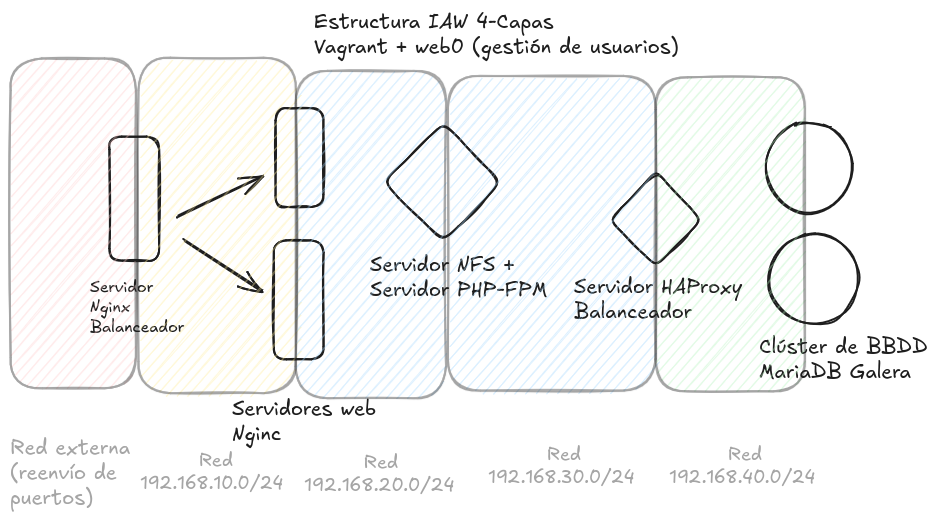

# Pila LEMP en 4 capas
Despliegue de una aplicación web de gestión de usuarios personalizada, en una infraestructura LEMP de alta disponibilidad de 4 capas, que son:
- Balanceo de carga de servidores Nginx
- Servidores Web
- Servidor de procesamiento PHP (PHP-FPM) y servidor gestor almacenamiento compartido (NFS)
- HAProxy para gestionar acceso a la base de datos
- Clúster MariaDB en modo galera

# Índice 

- [1. Vídeo de demostración](#video)
- [2. Introducción](#intro)
- [3. Explicación del aprovisionamiento del Servidor NFS](#aprov-nfs)
- [4. Explicación del aprovisionamiento de los servidores web](#aprov-web)
- [5. Explicación del aprovisionamiento del balanceador Web](#aprov-balanceador-web)
- [6. Explicación del aprovisionamiento de la BBDD, nodo 1](#aprov-BBDD-1)
- [7. Explicación del aprovisionamiento de la BBDD, nodo 2](#aprov-BBDD-2)
- [8. Explicación del aprovisionamiento del balanceador de BBDD](#aprov-HAProxy)
- [9. Explicación de la configuración en PHP](#php-configuration)
- [10. Disclaimer](#disclaimer)


# Vídeo demonstración

<a name="video"></a>


El vídeo también está disponible aquí:

https://drive.google.com/file/d/1ueWV8WSCezljir5RC7PGWgcWkHspnBYd/view?usp=drive_link

Cubre las siguientes cuestiones:


    Mostrar estado de las máquinas: vagrant status.
    Ping cada máquina a todas las demás.
    Sistemas de archivos montados en los servidores web: df -h en cada servidor web.
    Acceso a servidor MariaDB desde las máquinas serverweb1 y serverweb2.
    Acceso a Wordpress desde la máquina anfitriona (Windows) y el puerto mapeado.
    Mostrar el fichero /var/log/nginx/access.log en el balanceador de carga.
    Mostrar el fichero /var/log/nginx/access.log en los servidores web.
    Para el servidor web serverweb1 y volver a acceder a wordpress desde la m�quina anfitriona.
    Mostrar el fichero /var/log/nginx/access.log en los servidores web.
    Mostrar el contenido de la tabla Usuarios en ambos servidores mariaDB.


# Introducción

<a name="intro"></a>



En este proyecto se implementa una pila LEMP (Linux, Nginx, MySQL, PHP) en una arquitectura de 4 capas para garantizar alta disponibilidad y escalabilidad.
La arquitectura se despliega sobre Vagrant utilizando VirtualBox. La parte más complicada de esta práctica reside en la configuración de la comunicación entre los diferentes componentes y la sincronización de datos.

Por un lado, tenemos un clúster de BBDD configurado con HAProxy para balanceo de carga y alta disponibilidad, lo cual supone un desafío frente a una implementación más simple de una BBDD central, pero nos permite una mayor escalabidad, mejor rendimiento y tolerancia a fallos.

Otro desafío de la práctica es la gestión de PHP de manera totalmente separada de la gestión del servicio web. En este laboratorio, los servidores web son ambos capaces de comunicarse con un servidor de doble función (NFS por un lado, y PHP-FPM por otro) que ejecuta los procesos PHP, haciendo las consultas pertinentes de base de datos al servidor HAProxy (que decide a cuál de las dos BBDDD se la manda) y que por otro lado devuelve PHP procesado a los servidores para que estos sólo se encarguen de servir html estático.

<a name="aprov-nfs"></a>

# 3. Explicación del aprovisionamiento del Servidor NFS `provisionNFS_PHP.sh`

Por cuestiones de importancia, tiene más sentido empezar explicando el servidor NFS + PHP-FPM porque es el primero en lanzarse y resulta vital para otros servicios.

### Instalación

```bash

#!/bin/bash
# Script de provisionamiento para el servidor NFS + PHP-FPM
# Instala PHP-FPM y configura los servicios básicos
# Monta la app en el servidor NFS
# Este script se ejecuta antes de los servidores web en el orden de VagrantFile, así que todo bien.

sudo apt update

# Configurar PHP-FPM
sudo apt install -y php-fpm 
sudo apt install -y php8.2-mysql
sudo apt install -y php8.2-mysql php8.2-curl php8.2-zip
sudo apt install -y mariadb-client

```

Actualiza el repositorio e inicia la descarga de dependencias importantes.

```bash

sudo sed -i 's|^listen = .*|listen = 192.168.20.5:9000|' /etc/php/8.2/fpm/pool.d/www.conf
sleep 1
sudo systemctl restart php8.2-fpm

```

### Gestión de directorios

```bash

APP_DIR="/var/www/app"

sudo apt install -y nfs-kernel-server
sudo apt install -y git
sudo mkdir -p $APP_DIR
sudo chown -R www-data:www-data $APP_DIR
sudo chmod 755 $APP_DIR
echo "$APP_DIR 192.168.20.0/24(rw,sync,no_subtree_check)" | sudo tee /etc/exports
sudo exportfs -ra
sudo systemctl enable nfs-kernel-server
sudo systemctl restart nfs-kernel-server

```

Se declara como variable el directorio donde vamos a descargar/desarrollar nuestra app. Se instala el servicio NFS y git.

Se crea el directorio y se le da permisos y propiedad a www-data, el usuario del servidor web.

Se añade la subred 192.168.20.0 como permitida para acceder a este directorio compartido (decisión no ideal fuera de laboratorio)

Se actualiza y reinicia el servidor NFS.

### Exportación de compartición NFS
```bash
echo "$APP_DIR 192.168.20.0/24(rw,sync,no_subtree_check)" | sudo tee /etc/exports
sudo exportfs -ra
sudo systemctl enable nfs-kernel-server
sudo systemctl restart nfs-kernel-server
```
Configura NFS para que la subred 192.168.20.0/24 (donde están los servidores web) pueda montar `/var/www/app` con permisos de lectura-escritura. `Sync` asegura que los cambios se escriban inmediatamente en disco. `exportfs -ra` recarga la configuración sin reiniciar el demonio NFS.

### Descarga de la aplicación
```bash
if [ ! -f "$APP_DIR/index.php" ]; then
    echo "Aún no existe la app, descargándolo..."

    cd /tmp/
    git clone https://github.com/cgarciap58/practica_pila_lemp_4_capas_vagrant.git
    sudo cp -r practica_pila_lemp_4_capas_vagrant/src/* $APP_DIR/
    sudo rm -rf practica_pila_lemp_4_capas_vagrant
    cd $APP_DIR

fi
```
Verifica si la aplicación ya existe (index.php). Si no existe, clona el repositorio, copia los archivos fuente a `/var/www/app` y limpia archivos temporales. Esta lógica evita descargas repetidas en aprovisionamientos múltiples.

### Habilitación de errores en PHP
```bash
sudo sed -i 's/display_errors = .*/display_errors = On/' /etc/php/8.2/fpm/php.ini
sudo sed -i 's/display_startup_errors = .*/display_startup_errors = On/' /etc/php/8.2/fpm/php.ini
sudo systemctl restart php8.2-fpm
```
Activa la visualización de errores de PHP en desarrollo para facilitar debugging. En producción esto debería estar desactivado por seguridad.

### Configuración de permisos finales
```bash
sudo chown -R www-data:www-data $APP_DIR
sudo chmod -R 755 $APP_DIR
```
Asegura que www-data es el propietario de todos los archivos de la aplicación y que tienen permisos 755 (rwxr-xr-x), permitiendo lectura y ejecución para usuarios del sistema.

<a name="aprov-web"></a>

# 4. Explicación del aprovisionamiento de los servidores web (Nginx + PHP-FPM) - `provisionWeb.sh`

### Actualización e instalación de dependencias
```bash
sudo apt update
sudo apt install -y nginx
sudo apt install -y nfs-common
```
Instala Nginx como servidor web y nfs-common para poder montar comparticiones NFS.

### Montaje de la aplicación via NFS
```bash
sudo mkdir -p $APP_DIR
echo "$NFS_SERVER:$NFS_EXPORT $APP_DIR nfs defaults,_netdev 0 0" | sudo tee -a /etc/fstab
sudo mount $NFS_SERVER:$NFS_EXPORT $APP_DIR
```
Crea el directorio local, añade la entrada en fstab para montar automáticamente en reboots y monta la compartición NFS con la aplicación.

### Configuración de Nginx para PHP
```bash
NGINX_SITE="/etc/nginx/sites-available/app"
sudo tee $NGINX_SITE > /dev/null << 'EOF'
server {
    listen 80;
    server_name _;

    root /var/www/app;
    index index.php index.html;

    location / {
        index index.php index.html;
        try_files $uri $uri/ /index.php?$args;
    }

    location ~ \.php$ {
        include fastcgi_params;
        include snippets/fastcgi-php.conf;
        fastcgi_pass 192.168.20.5:9000;
        fastcgi_param SCRIPT_FILENAME /var/www/app$fastcgi_script_name;
    }
}
EOF
```
Configura Nginx para servir archivos estáticos y delegar procesamiento PHP a PHP-FPM en 192.168.20.5:9000. Reescribe URLs para aplicaciones tipo MVC/SPA.

### Habilitación y reinicio
```bash
sudo ln -sf /etc/nginx/sites-available/app /etc/nginx/sites-enabled/app
sudo rm -f /etc/nginx/sites-enabled/default
sudo systemctl restart nginx.service
```
Activa la configuración de la aplicación, desactiva el sitio default y reinicia Nginx.


<a name="aprov-balanceador-web"></a>


# 5. Explicación del aprovisionamiento del balanceador Web (Nginx) - `provisionBalanceador.sh`

### Actualización del sistema e instalación de Nginx
```bash
sudo apt update -y
sudo apt install -y nginx
```
Actualiza los repositorios del sistema e instala Nginx, que actuará como balanceador de carga.

### Creación de configuración upstream
```bash
cat > /etc/nginx/sites-available/balanceador <<EOL
upstream backend {
    server 192.168.10.3;
    server 192.168.10.4;
}
EOL
```
Define un grupo de servidores backend donde se distribuirá el tráfico. Nginx realizará round-robin automáticamente entre los dos servidores web.

### Configuración del servidor proxy
```bash
server {
    listen 80;

    location / {
        proxy_pass http://backend;
        proxy_set_header Host $host;
        proxy_set_header X-Real-IP $remote_addr;
        proxy_set_header X-Forwarded-For $proxy_add_x_forwarded_for;
        proxy_set_header X-Forwarded-Proto $scheme;
    }
}
EOL
```
Configura el servidor para escuchar en puerto 80 y redirigir todas las peticiones a los servidores backend. Preserva información de IP y protocolo original mediante headers.

### Habilitación de la configuración
```bash
ln -sf /etc/nginx/sites-available/balanceador /etc/nginx/sites-enabled/balanceador
sudo rm -f /etc/nginx/sites-enabled/default
```
Crea un enlace simbólico para activar la configuración y elimina la configuración default de Nginx.

### Validación y reinicio
```bash
nginx -t
systemctl restart nginx
```
Valida la sintaxis de la configuración y reinicia el servicio para aplicar cambios.

---

<a name="aprov-BBDD-1"></a>

# 6. Explicación del aprovisionamiento de la BBDD, nodo 1 - `provisionDB1.sh`

### Actualización e instalación de MariaDB con Galera
```bash
sudo apt update
sudo apt install mariadb-server mariadb-backup galera-4 -y
sudo apt install net-tools -y
```
Instala MariaDB, las herramientas de backup y el cluster de replicación Galera. Net-tools proporciona utilidades de diagnóstico de red.

### Configuración de seguridad inicial
```bash
sudo mariadb <<EOF
DELETE FROM mysql.user WHERE User='';
DROP USER IF EXISTS 'root'@'%';
ALTER USER 'root'@'localhost' IDENTIFIED BY 'roottoor';
DROP DATABASE IF EXISTS test;
FLUSH PRIVILEGES;
EOF
```
Elimina usuarios anónimos, desactiva acceso remoto root, configura contraseña de root y elimina la base de datos de prueba.

### Creación de base de datos y usuario
```bash
mysql -u root -p"$root_pass" -e "CREATE DATABASE $db;"
mysql -u root -p"$root_pass" -e "CREATE USER '$user_db'@'%' IDENTIFIED BY '$pass_db';"
mysql -u root -p"$root_pass" -e "GRANT ALL PRIVILEGES ON $db.* TO '$user_db'@'%';"
mysql -u root -p"$root_pass" -e "FLUSH PRIVILEGES;"
```
Crea la base de datos `web0app`, un usuario `dbuser` con acceso desde cualquier host y le otorga permisos sobre la base de datos.

### Creación de tabla inicial
```bash
mysql -u root -p"$root_pass" -e "USE $db; CREATE TABLE users (
  id INT UNSIGNED AUTO_INCREMENT PRIMARY KEY,
  name VARCHAR(100) NOT NULL,
  age INT UNSIGNED NOT NULL,
  email VARCHAR(100) UNIQUE NOT NULL
) ENGINE=InnoDB DEFAULT CHARSET=utf8;
"
```
Crea una tabla `users` con estructura básica, usando InnoDB para soporte de transacciones.

### Configuración de Galera Cluster
```bash
sudo tee /etc/mysql/mariadb.conf.d/90-galera.cnf > /dev/null <<'EOF'
[mysqld]
wsrep_on=ON
wsrep_provider=/usr/lib/galera/libgalera_smm.so
wsrep_cluster_name=galera_cluster
wsrep_cluster_address=gcomm://192.168.40.7,192.168.40.8

wsrep_node_name=db1
wsrep_node_address=192.168.40.7

binlog_format=ROW
default_storage_engine=InnoDB
innodb_autoinc_lock_mode=2

bind-address=192.168.40.7
EOF
```
Configura este servidor como primer nodo del cluster Galera. Define que se conectará con db2 en la red 192.168.40.0, habilita replicación fila a fila y ajusta configuraciones para consistencia en cluster.

### Inicio del cluster
```bash
sudo systemctl stop mariadb
sudo pkill -f mariadbd
sudo galera_new_cluster
```
Detiene MariaDB, mata procesos residuales e inicializa este servidor como nodo maestro del cluster Galera.

---
<a name="aprov-BBDD-2"></a>


# 7. Explicación del aprovisionamiento de la BBDD, nodo 1 - `provisionDB2.sh`

### Actualización e instalación de MariaDB con Galera
```bash
sudo apt update
sudo apt install mariadb-server mariadb-backup galera-4 -y
sudo apt install net-tools -y
```
Idéntica al DB1: instala MariaDB, backup y Galera para replicación en cluster.

### Configuración de Galera como nodo secundario
```bash
sudo tee /etc/mysql/mariadb.conf.d/90-galera.cnf > /dev/null <<'EOF'
[mysqld]
wsrep_on=ON
wsrep_provider=/usr/lib/galera/libgalera_smm.so
wsrep_cluster_name=galera_cluster
wsrep_cluster_address=gcomm://192.168.40.7,192.168.40.8

wsrep_node_name=db2
wsrep_node_address=192.168.40.8

binlog_format=ROW
default_storage_engine=InnoDB
innodb_autoinc_lock_mode=2

bind-address=192.168.40.8
EOF
```
Configura este servidor como segundo nodo del cluster. Se conectará al nodo db1 (ya existente) y sincronizará automáticamente la base de datos y usuario. La dirección de bind es diferente (192.168.40.8).

### Reinicio para unirse al cluster
```bash
sudo systemctl restart mariadb
```
Reinicia MariaDB para aplicar la configuración Galera y unirse automáticamente al cluster existente.

---
<a name="aprov-HAProxy"></a>

# 8. Explicación del balanceador de base de datos - `provisionProxyDB.sh`

### Actualización e instalación de HAProxy
```bash
sudo apt update
sudo apt install haproxy -y
```
Instala HAProxy, que actuará como proxy TCP para las conexiones MySQL/MariaDB.

### Configuración del balanceador de base de datos
```bash
cat > /etc/haproxy/haproxy.cfg << 'EOF'
frontend mysql_front
    bind *:3306
    mode tcp
    default_backend mysql_back

backend mysql_back
    mode tcp
    balance roundrobin
    server db1 192.168.40.7:3306 check
    server db2 192.168.40.8:3306 check
EOF
```
Configura HAProxy en modo TCP (no HTTP). El frontend escucha puerto 3306 y distribuye conexiones en round-robin entre db1 y db2, realizando health checks automáticos.

### Activación del servicio
```bash
sudo systemctl enable haproxy
sudo systemctl restart haproxy
```
Habilita HAProxy para iniciar automáticamente en arranques y reinicia el servicio para aplicar la configuración.

---

## 9. Configuración de Base de Datos - `src/config.php`

### Definición de constantes de conexión
```php
define('DB_HOST', '192.168.30.6');
define('DB_NAME', 'web0app');
define('DB_USER', 'dbuser');
define('DB_PASSWORD', 'dbpass');
```
Define las constantes globales para conexión a la base de datos. `DB_HOST` apunta a **192.168.30.6** que es la dirección del HAProxy (proxy de base de datos), no directamente a los servidores MariaDB. Esto permite que las conexiones se distribuyan automáticamente entre db1 y db2 a través del balanceo de carga de HAProxy.

### Establecimiento de conexión MySQLi
```php
$mysqli = mysqli_connect(DB_HOST, DB_USER, DB_PASSWORD, DB_NAME);

if (!$mysqli) {
    die('Database connection failed: ' . mysqli_connect_error());
}
```
Crea una conexión a la base de datos usando la extensión MySQLi (MySQL Improved). Si la conexión falla, el script termina mostrando el error específico. Esta conexión se establece cada vez que se incluye este archivo, permitiendo que toda la aplicación utilice `$mysqli` como objeto de conexión global.
